# Домашнє завдання по темі 4

## 1. Створіть базу даних для керування бібліотекою книг згідно зі структурою, наведеною нижче. Використовуйте DDL-команди для створення необхідних таблиць та їх зв'язків.

### 1.a. Назва схеми — “LibraryManagement”

```sql
CREATE SCHEMA `library_management`;
```

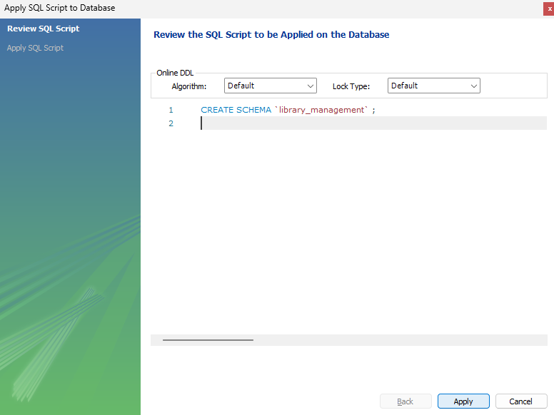

### 1.b. Таблиця "authors":

- `author_id` (INT, автоматично зростаючий PRIMARY KEY)
- `author_name` (VARCHAR)

```sql
CREATE TABLE `library_management`.`authors` (
    `author_id` INT AUTO_INCREMENT PRIMARY KEY,
    `author_name` VARCHAR(255) NOT NULL
);
```

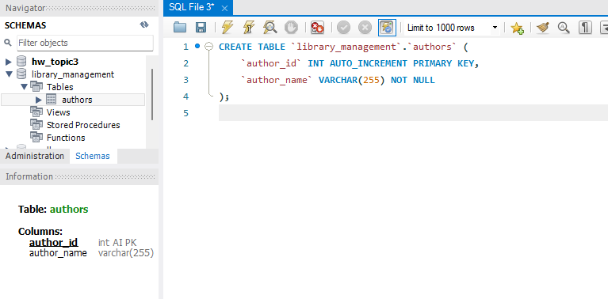


### 1.c. Таблиця "genres":

- `genre_id` (INT, автоматично зростаючий PRIMARY KEY)
- `genre_name` (VARCHAR)

```sql
CREATE TABLE `library_management`.`genres` (
    `genre_id` INT AUTO_INCREMENT PRIMARY KEY,
    `genre_name` VARCHAR(255) NOT NULL
);
```

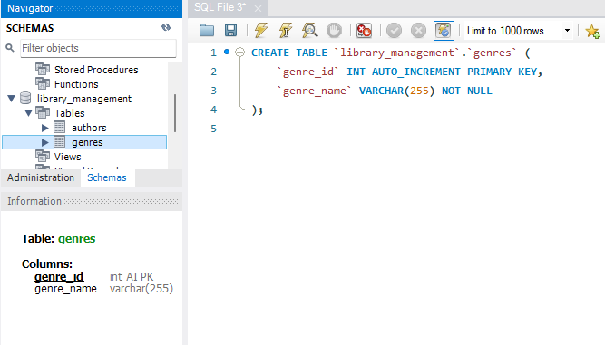

### 1.d. Таблиця "books":

- `book_id` (INT, автоматично зростаючий PRIMARY KEY)
- `title` (VARCHAR)
- `publication_year` (YEAR)
- `author_id` (INT, FOREIGN KEY зв'язок з "Authors")
- `genre_id` (INT, FOREIGN KEY зв'язок з "Genres")

```sql
CREATE TABLE `library_management`.`books` (
    `book_id` INT AUTO_INCREMENT PRIMARY KEY,
    `title` VARCHAR(255) NOT NULL,
    `publication_year` YEAR NOT NULL,
    `author_id` INT,
    `genre_id` INT,
    FOREIGN KEY (`author_id`) REFERENCES `authors`(`author_id`),
    FOREIGN KEY (`genre_id`) REFERENCES `genres`(`genre_id`)
);
```

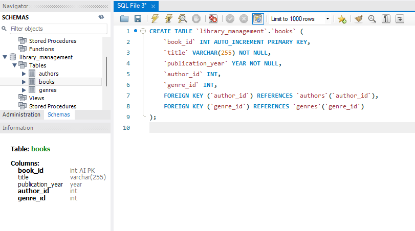

### 1.e. Таблиця "users":

- `user_id` (INT, автоматично зростаючий PRIMARY KEY)
- `username` (VARCHAR)
- `email` (VARCHAR)

```sql
CREATE TABLE `library_management`.`users` (
    `user_id` INT AUTO_INCREMENT PRIMARY KEY,
    `username` VARCHAR(255) NOT NULL,
    `email` VARCHAR(255) NOT NULL
);
```

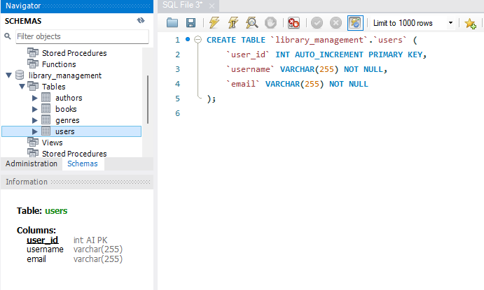

### 1.f. Таблиця "borrowed_books":

- `borrow_id` (INT, автоматично зростаючий PRIMARY KEY)
- `book_id` (INT, FOREIGN KEY зв'язок з "Books")
- `user_id` (INT, FOREIGN KEY зв'язок з "Users")
- `borrow_date` (DATE)
- `return_date` (DATE)

```sql
CREATE TABLE `library_management`.`borrowed_books` (
    `borrow_id` INT AUTO_INCREMENT PRIMARY KEY,
    `book_id` INT,
    `user_id` INT,
    `borrow_date` DATE NOT NULL,
    `return_date` DATE,
    FOREIGN KEY (`book_id`) REFERENCES `books`(`book_id`),
    FOREIGN KEY (`user_id`) REFERENCES `users`(`user_id`)
);
```

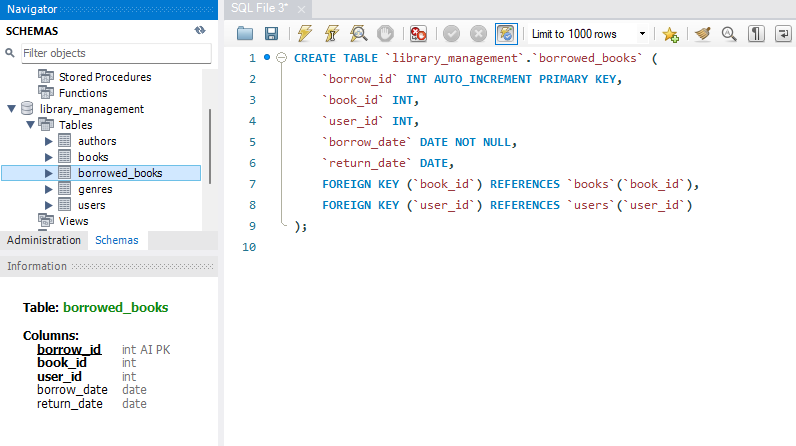

## 2. Заповніть таблиці простими видуманими тестовими даними. Достатньо одного-двох рядків у кожну таблицю.

```sql
INSERT INTO `library_management`.`authors` (`author_name`) VALUES ('Автор 1'), ('Автор 2');
INSERT INTO `library_management`.`genres` (`genre_name`) VALUES ('Жанр 1'), ('Жанр 2');
INSERT INTO `library_management`.`books` (`title`, `publication_year`, `author_id`, `genre_id`) VALUES
    ('Книга 1', 2020, 1, 1),
    ('Книга 2', 2021, 2, 2);
INSERT INTO `library_management`.`users` (`username`, `email`) VALUES
    ('Користувач 1', 'user1@example.com'),
    ('Користувач 2', 'user2@example.com');
INSERT INTO `library_management`.`borrowed_books` (`book_id`, `user_id`, `borrow_date`, `return_date`) VALUES
    (1, 1, '2026-03-02', '2026-03-20'),
    (2, 2, '2026-03-01', NULL);
```

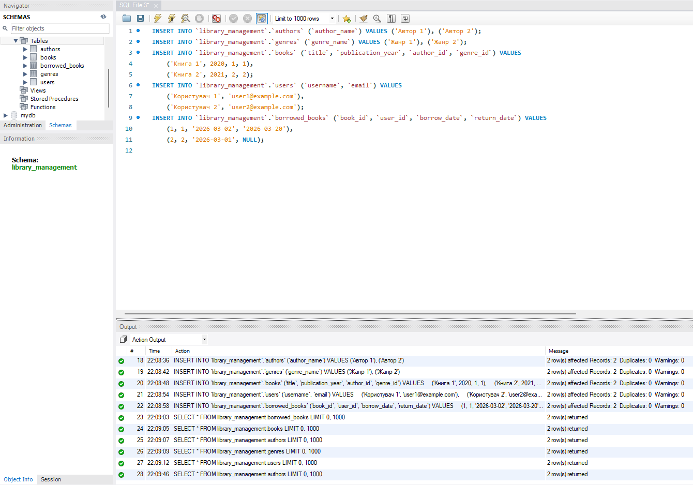

## 3. Перейдіть до бази даних, з якою працювали у темі 3. Напишіть запит за допомогою операторів FROM та INNER JOIN, що об’єднує всі таблиці даних, які ми завантажили з файлів: order_details, orders, customers, products, categories, employees, shippers, suppliers. Для цього ви маєте знайти спільні ключі.

```sql
USE `hw_topic3`;

SELECT
    `prd`.`name` AS `product_name`,
    `prd`.`price`,
    `ord_d`.`quantity`,
    `catg`.`name` AS `category`,
    `cust`.`contact` AS `client_name`,
    `cust`.`address` AS `client_address`,
    `ord`.`date` AS `order_date`,
    `supl`.`city` AS `supplier_city`,
    `supl`.`postal_code` AS `supplier_postal_code`,
    CONCAT(`empl`.`first_name`, ' ', `empl`.`last_name`) AS `employee`,
    `ship`.`name` AS `shipper_name`
FROM
    `orders` AS `ord`
        INNER JOIN
    `order_details` AS `ord_d` ON `ord`.`id` = `ord_d`.`order_id`
        INNER JOIN
    `products` AS `prd` ON `ord_d`.`product_id` = `prd`.`id`
        INNER JOIN
    `suppliers` AS `supl` ON `prd`.`supplier_id` = `supl`.`id`
        INNER JOIN
    `categories` AS `catg` ON `prd`.`category_id` = `catg`.`id`
        INNER JOIN
    `customers` AS `cust` ON `ord`.`customer_id` = `cust`.`id`
        INNER JOIN
    `employees` AS `empl` ON `ord`.`employee_id` = `empl`.`employee_id`
        INNER JOIN
    `shippers` AS `ship` ON `ord`.`shipper_id` = `ship`.`id`;
```

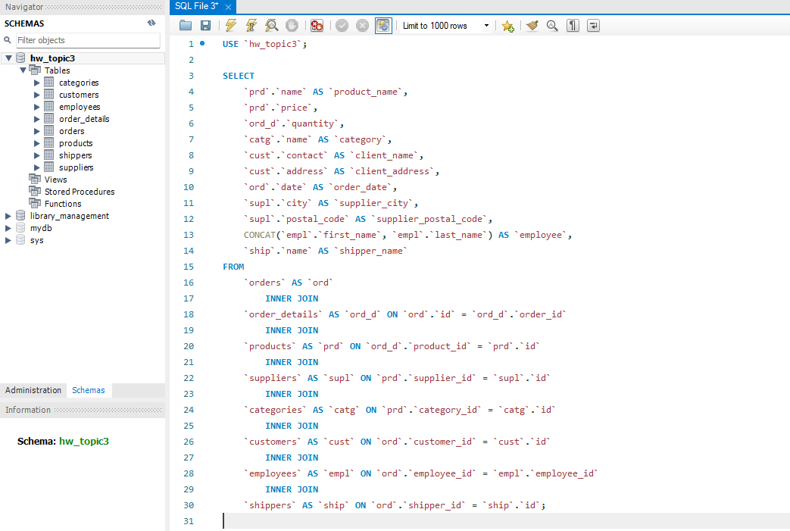

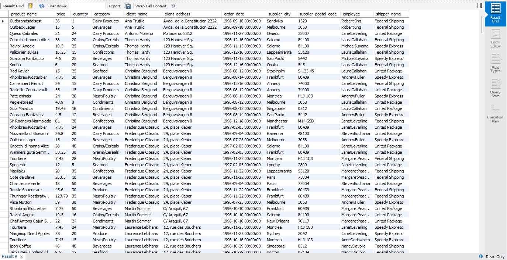

## 4. Виконайте запити, перелічені нижче.

- a. Визначте, скільки рядків ви отримали (за допомогою оператора COUNT).

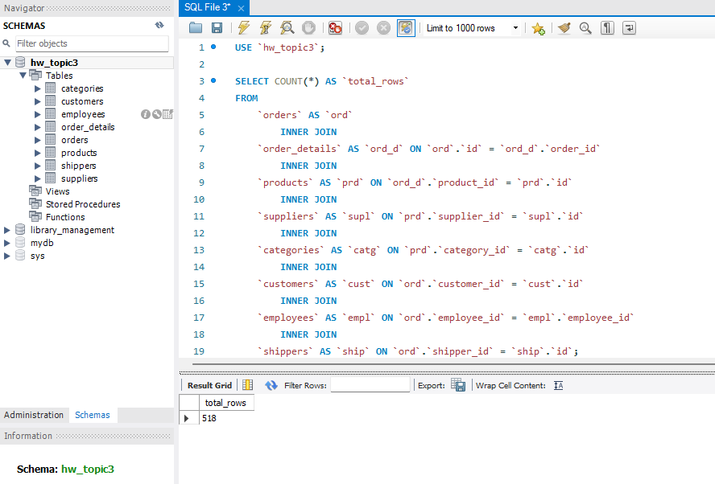

- b. Змініть декілька операторів INNER на LEFT чи RIGHT. Визначте, що відбувається з кількістю рядків. Чому? Напишіть відповідь у текстовому файлі.

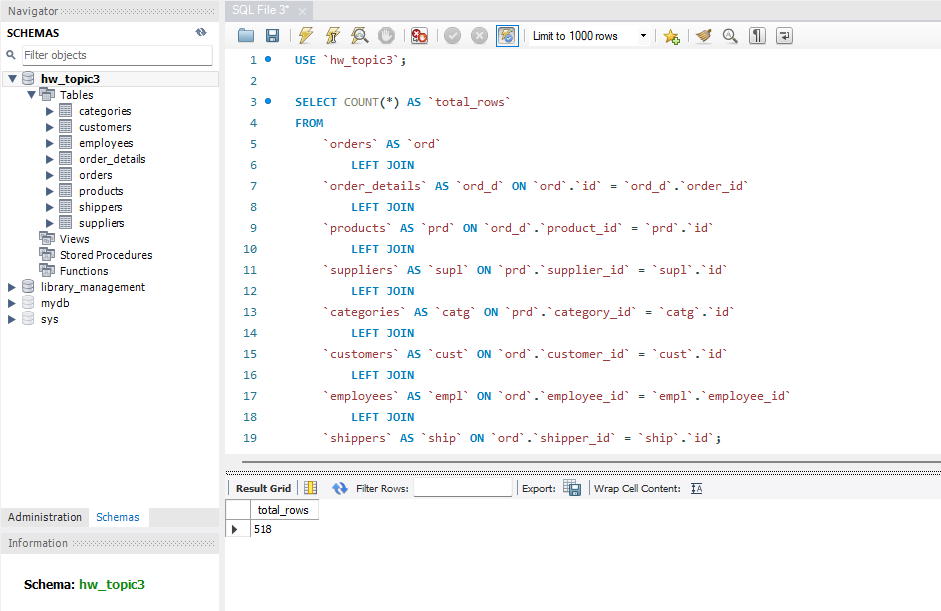

Файл з поясненням `p4b.txt`:

```txt
На прикладі з SQL запитом з 3го пункту було замінено всі INNER JOIN на LEFT JOIN,
та результат не змінився, це пояснюється тим, що для кожного поєднання таблиць
умова ON завжди виконується, так само як би вона виконувалась для INNER JOIN.

Але на наступному, більш простому прикладі:

"""sql
USE `hw_topic3`;

SELECT
    *
FROM
    `employees` AS `empl`
        INNER JOIN
    `orders` AS `ord` ON `ord`.`employee_id` = `empl`.`employee_id`
WHERE
    `empl`.`employee_id` = 10;
"""

цей запит видасть 0 рядків. Але якщо замінити INNER JOIN на LEFT JOIN,
то запит видасть 1 рядок, де всі поля з таблиці orders будуть NULL,
тому що в таблиці orders немає рядків, де employee_id дорівнює 10.
Та це пояснюється тим, що LEFT JOIN повертає абсолютно всі рядки
з лівої таблиці незалежно від того, чи є відповідні рядки в правій таблиці,
та невідповідні поля з правої таблиці будуть заповнені NULL.
```

Результат запиту з INNER JOIN (0 рядків):

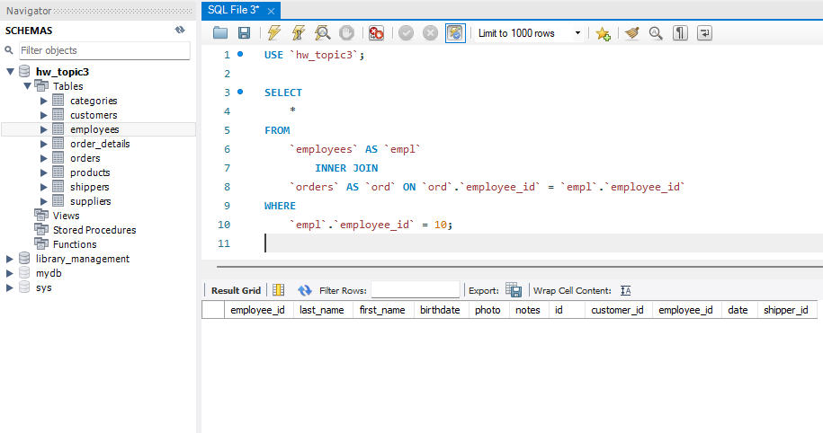

Результат запиту з LEFT JOIN (1 рядок, права таблиця заповнена NULL):

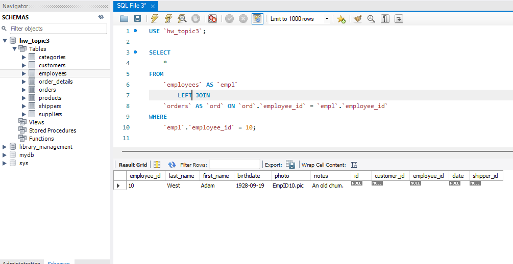

- c. На основі запита з пункта 3 виконайте наступне: оберіть тільки ті рядки, де employee_id > 3 та ≤ 10.

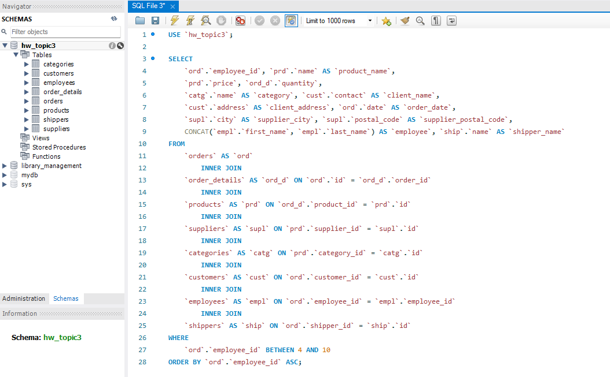

Результат у зростаючому порядку:

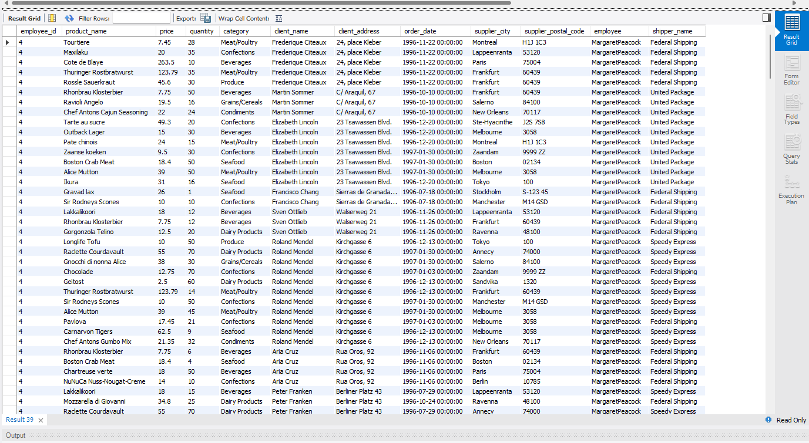

Результат у спадаючому порядку:

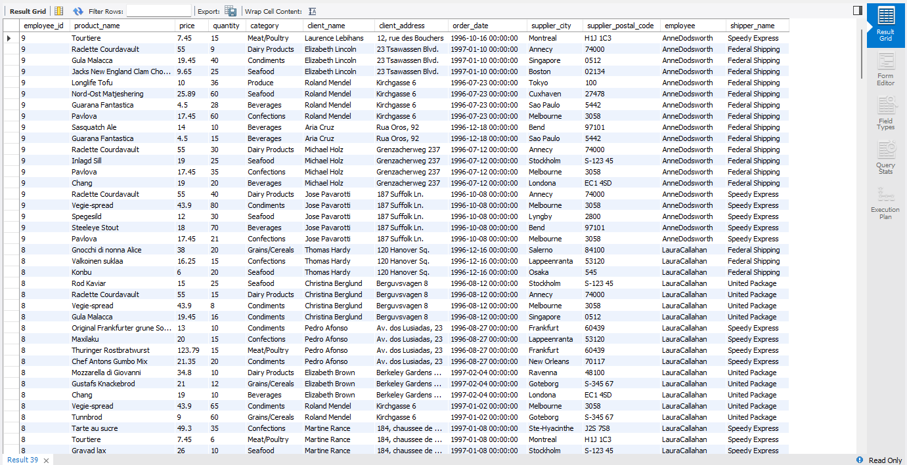

```txt
У descending порядку можна побачити що employee_id починається з 9.
Це тому що у таблиці orders немає записів де employee_id = 10.
```

- d. Згрупуйте за іменем категорії, порахуйте кількість рядків у групі, середню кількість товару (кількість товару знаходиться в order_details.quantity)

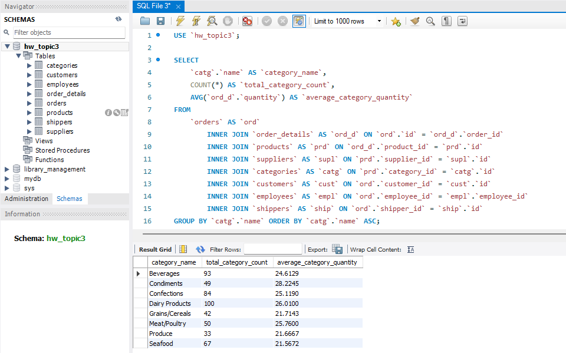

- e. Відфільтруйте рядки, де середня кількість товару більша за 21.

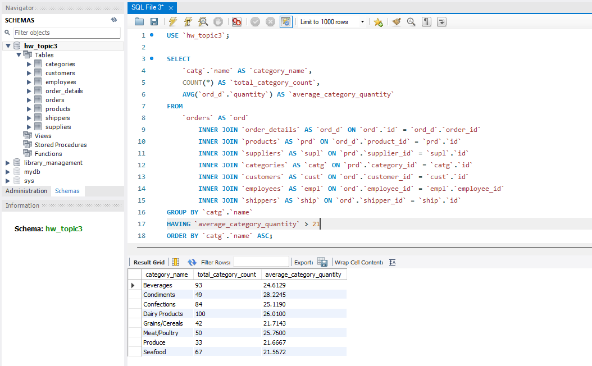

Та варіант з 22 замість 21 для перевірки що фільтрація працює:

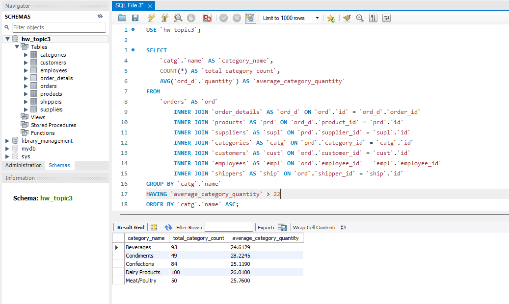

- f. Відсортуйте рядки за спаданням кількості рядків.

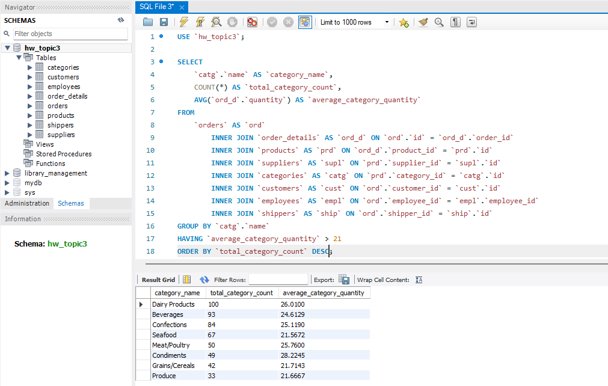

- g. Виведіть на екран (оберіть) чотири рядки з пропущеним першим рядком.

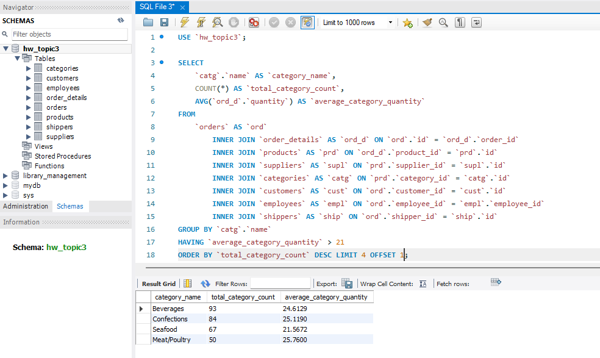
